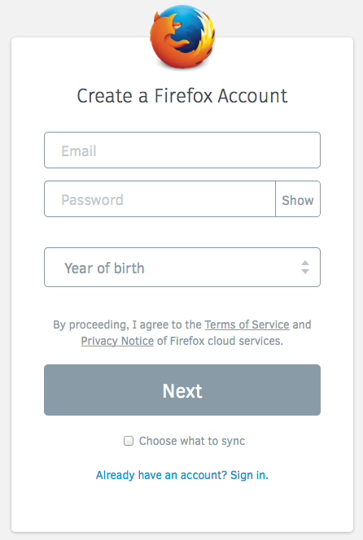
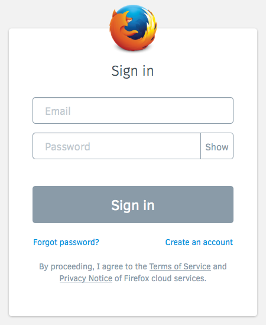

Slug: 50-new-sync-protocol
Date: 2014-03-25 18:05
Title: The new Sync protocol

(This wraps up a two-part series on upcoming changes in Firefox Sync, based on [my presentation](http://people.mozilla.org/~bwarner/warner-rwc2014/#/) at [RealWorldCrypto 2014](http://realworldcrypto.wordpress.com/). Part 1 was about problems we observed in the old system. Part 2 is about the system which replaces it.)

[Last time](../49-pairing-problems) I described the user difficulties we observed with the pairing-based Sync we shipped in Firefox 4.0. In late April, we'll be releasing Firefox 29, with a new password-based Sync
setup process. In this post, I want to describe a little bit about the protocol we use in the new system, and the security properties you can expect to get out of it.

(for the gory details, you can jump directly to the full [technical definition](https://github.com/mozilla/fxa-auth-server/wiki/onepw-protocol) of the protocol, which we've nicknamed "onepw", since there is now just "one password" to protect both account access and your encrypted data)

## New Requirements

To recap the last post, the biggest frustration we saw with the old Sync setup process was that it didn't "work like other systems": users *thought* that their email and password would be sufficient to get their data back, but in fact it really required access to a device that was already attached to your account. This made it unsuitable for people with a single device, and made it mostly impossible to recover from the all-too-common case of losing your only browser.

So the biggest new requirement for Sync was to make your data recoverable with just email+password.

We've retained the requirement that Sync data is end-to-end encrypted, using a key that is only available to you and your personal devices.

And finally, we're rolling out a new system called Firefox Accounts, aka "FxA", which will be used to manage access to new server-based features like the application marketplace and FirefoxOS-specific services. The third requirement was to make Sync work well with the new Accounts.

## Firefox Accounts: Login + Keys

So we designed Firefox Accounts to both support the needs of traditional login-only applications, *and* provide the secrets necessary to safely encrypt your Sync data.

Each account has two encryption keys. Sync uses a key called "kB", which is protected by your account password (in technical terms, the FxA server holds a "wrapped copy" of kB, which requires your password to unwrap). To access any data encrypted under kB, you must remember your password. This means that anyone who *doesn't* know the password can't see your data.

If you forget the password, you'll have to reset the account and create a new kB, which will erase both the old kB and the data it was protecting. This is a necessary consequence of properly protecting kB with the password: if there were any other way for you to recover the data without the password, then a bad guy could do the same thing.

FxA also manages a second key named "kA", which can be used for "recoverable data". We don't have any applications which use kA yet, but we might add some in the future. This key is stored by the server without wrapping, so that you, the account owner, can recover this data even if you forget the account password. As long as you can still receive email at the registered address, you can reset the account (to a new password) and get back "kA", along with any data encrypted under it.

"kA" and "kB" are "root" keys: each application will get a distinct derivative

In addition to the two 

The server is never told your password. The [key-wrapping protocol](https://github.com/mozilla/fxa-auth-server/wiki/onepw-protocol#-fetching-sync-keys) uses "key-stretching" on your password before sending anything to the server, to make it hard for the compromised server to even attempt to guess your password. And the data stored on the server is stretched even further, to make static compromises of the server's database less useful to an attacker.

## ...

Each account is tied to an email address. You'll need to prove your control of the email address (by clicking on a link in a challenge email that get sent upon account creation) before you can do anything with it.

Then, when you sign in, you'll type your email and password into 

But in Firefox 29, due to be released next month, Sync will switch to using Firefox Accounts. Instead of pairing, you'll set up a new device by typing in an email address and password. I'll have a blog post soon about the protocol that it uses, but first I wanted to explain a little bit about the problems we observed with the FF4.0 pairing scheme.

This post provides a brief description of the new protocol we're using for Sync in FF29.

## What Does It Look Like?

In FF29, when you set up Sync for the first time, you'll see a regular box that asks for an email address and a (new) password:

You fill that out, hit the button, then the server sends you a confirmation email. Click on the link in the email, and your browser automatically creates an encryption key and starts uploading ciphertext.

Connecting a second device to your account is as simple as signing in with the same email and password:

## Enter Firefox Accounts

This year, the Identity group is introducing "Firefox Accounts", which
will be used to access a variety of Mozilla services (like the app
Marketplace and the Where's My Fox phone-recovery system). These
accounts will be based around an email address and a password, just like
the hundreds of other account systems you're already familiar with.

We're changing Sync to use Firefox Accounts, instead of pairing. The
security goals remain the same: there is still a strong random secret
key, and the servers cannot decrypt your data. But instead of using
pairing to get this key from one device to another, the key is protected
by the password that you enter. This means you can recover all your
data, even if you've lost all your devices at the same time (or your
only phone breaks), by setting up a new device and typing your Firefox
Account email and password into it. The new device will connect to the
account and download all the saved encrypted data.

The security of your data now depends upon your password: if it is
guessable, then somebody else can connect to your account and see your
data too. So make sure you pick a strong password. The best passwords
are randomly generated.

For the technical details of the new encryption scheme works, check out
<this blog post> by the security engineers developing it.

The new system is scheduled to appear in Firefox 29, to be released on
April 29th. We hope you enjoy using it!
